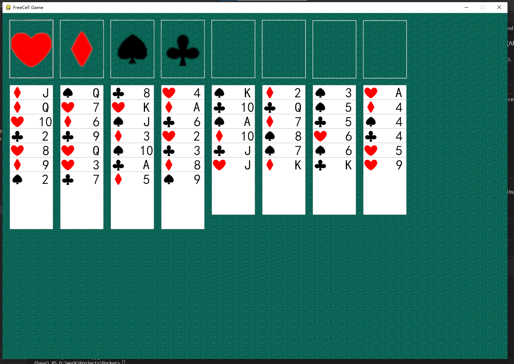

# FreeCell AI

Freecell is a very classic solitaire game. Since 2000, people have began to find a efficient solver for it.

This is my built with pygame.

Can we build a AI to play it as smart as human? As for me, finding the solve can be done in less than 200 steps search. Human intelligence is awesome!

I have tried DRN method to solve this problem. But its performance is terrible.

While looking deeply into this problem, after reading some reference, I got lessons from AlphaZero.

I use train a MLP to emulate the steps number to the final for every game state. Then use heuristic search to replace the Rollout method.

And the solver now can find the solve in 2000 steps in some easy game.

I will keep working on it during my free time : )